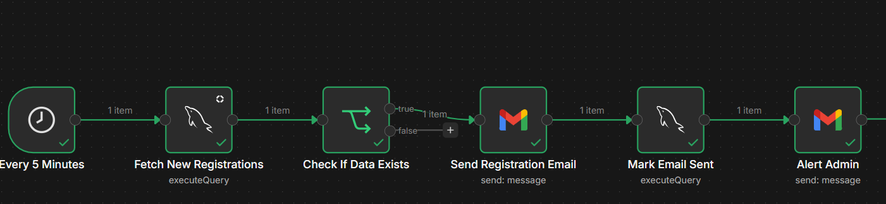

Semi-Automated Event Management System

A Java-based Event Management System that automates the full event lifecycle — from registration to post-event feedback — using n8n workflows connected to a cloud MySQL database and several external APIs.

What It Does
Registration: Users fill out a registration form and accept the Terms & Conditions. On submission, n8n automatically triggers a confirmation email — no manual work needed.
Admin Dashboard: Admins can set event details, and add, remove, or manage participants. All changes sync directly to a cloud MySQL database hosted on Railway.
Post-Event Feedback: Once an event ends, n8n automatically sends attendees a Google Form. Responses are collected and stored in Google Sheets.
AI-Powered Automation: The system integrates several APIs inside n8n:
Gmail API – sends automated emails
Google Sheets API – syncs feedback responses
Gemini AI – analyzes feedback intelligently
Groq API – supports fast AI-based processing
Tech Stack
Backend: Java
Database: MySQL (Railway, cloud-hosted)
Automation: n8n
APIs: Gmail, Google Sheets, Gemini AI, Groq

Setup instructions for connecting the database and n8n are below.

Java-based Event Management app using an online MySQL database (hosted on Railway), automated with n8n.

---

## 1. Connect the Online Database (Railway MySQL)

1. Create a free account at [Railway](https://railway.app) and add a **MySQL** database.
2. Open the database → **Connect** tab → copy the Host, Port, Database name, Username, and Password.
3. In the project, copy database credential  to `Database.java`.
4. Replace the dummy values with your real Railway credentials:

```java
private static final String URL  = "jdbc:mysql://<your-host>:<port>/<database>";
private static final String USER = "<your-username>";
private static final String PASS = "<your-password>";
```

5. Compile and run:
```bash
javac -cp "lib/mysql-connector-j-9.7.0.jar" *.java
java -cp ".;lib/mysql-connector-j-9.7.0.jar" Main
```


---

## 2. Connect n8n to the Same Database

1. Open n8n (cloud or self-hosted via `npx n8n`).
2. Go to **Credentials → New → MySQL**, and enter the same Railway details (host, port, database, user, password).
3. Import `n8n/workflow.json` into n8n (**Import from File**).
4. Open each MySQL node in the workflow and select the credential you just created.
5. Activate the workflow.

### Workflow overview


```
Every 5 Minutes → Fetch New Registrations (executeQuery) → Check If Data Exists
   → (true) Send Registration Email → Mark Email Sent (executeQuery) → Alert Admin
   → (false) do nothing
```

- Runs every 5 minutes, checks the Railway database for new registrations.
- If new data exists, sends a registration confirmation email, marks it as sent in the database, then alerts the admin.
- If no new data, the workflow stops.

Both the Java app and n8n connect independently to the same Railway database — that's the shared link between them.
